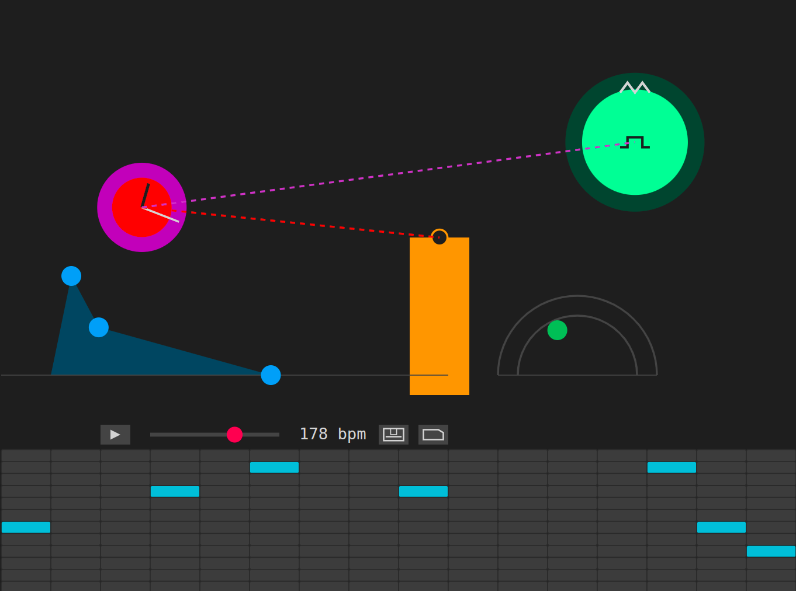

# Sintetizador Xeométrico



## Un lenzo para pintar con sons

Este é un instrumento musical experimental. Non penses en notas ou escalas, senón en formas, cores e movementos. A interface é o propio instrumento. Toca, explora e descobre paisaxes sonoras.

## Exploración Sonora

A clave deste sintetizador é a interacción directa. Non hai botóns nin menús complexos, só figuras que podes manipular.

*   **Arrastra as figuras:** É a acción principal. Preme en calquera forma de cor e, sen soltar, móvea polo lenzo. Observa como o son se transforma. Cada figura controla unha parte distinta da alma do son.
    *   **Círculos (o corazón):** Os dous círculos do centro son a fonte principal do son. Arrastralos de arriba a abaixo cambia o ton (de grave a agudo). De esquerda a dereita, cambia a intensidade e o carácter.
    *   **Rectángulo laranxa (a cor):** Modifica a textura do son, facéndoo máis brillante e afiado ou máis opaco e suave.
    *   **Figura azul (a forma):** Controla como ataca e como se esvaece cada nota. Podes crear desde "plinks" curtos e percusivos ata sons que medran e morren lentamente.
    *   **Semicírculo verde (o eco):** Engade repeticións e profundidade, creando unha sensación de espazo.

*   **Botón dereito do rato:** Fai clic co botón dereito sobre os círculos para cambiar a súa "voz" interna ou as conexións. Verás como o pequeno debuxo do seu interior cambia, ou aparecen liñas conectando os círculos, ofrecendo novas paletas sonoras para explorar. 

*   **Barra de espazo:** Mantén unha nota soando de forma indefinida. Cando arrastras un dos círculos centrais para crear un son, pulsa a barra de espazo. O son quedará "conxelado", permitíndoche seguir modificando outros parámetros mentres soa. Vólvea a pulsar para liberalo.

*   **A reixa inferior (o ritmo):** É un secuenciador. Fai clic nos cadrados para debuxar patróns. O botón de Play/Stop e o control de tempo (bpm) permítenche crear bucles e melodías.

## Gardar e Cargar

Nos controis do secuenciador, atoparás dous botóns para gardar as túas creacións (presets) nun ficheiro e cargalos máis tarde.

## Como poñelo en marcha

Se descargaches o código, necesitarás ter Node.js instalado. Abre un terminal na carpeta do proxecto e executa:

```bash
# Instala as dependencias necesarias
npm install

# Arranca a aplicación
npm start
```
